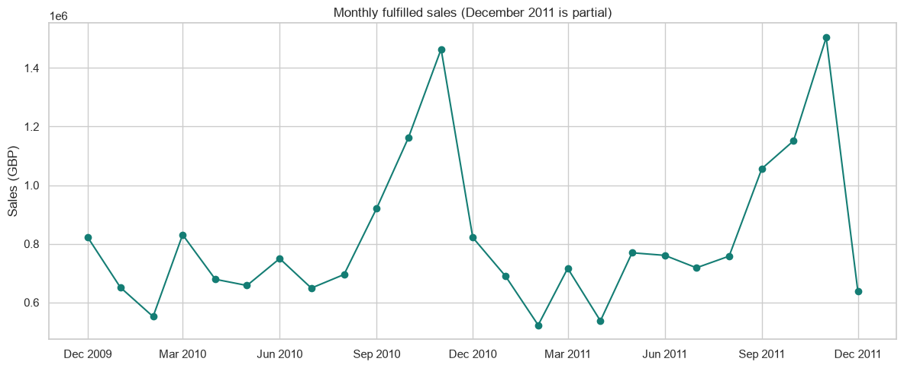
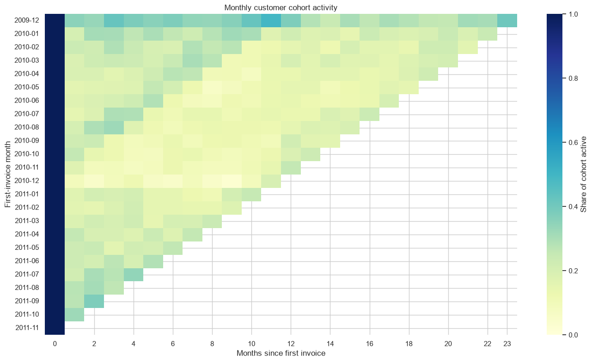
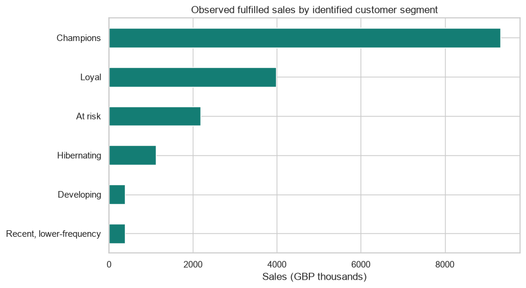

# Retail Growth Analytics

**SQL · Python · Customer analytics · Commercial decision-making**

An end-to-end analysis of the UCI Online Retail II transaction dataset. I cleaned and loaded invoice-line data into SQLite, used SQL and pandas to investigate sales and customer behavior, and translated the results into measurable retention and data-quality actions.

> **Executive takeaway:** Identified customers in the RFM Champions segment represent 53.7% of identified positive sales. Prioritize a measured retention test for this high-value group, while testing reactivation for less-recent frequent buyers. Interpret customer findings alongside a material ID coverage gap: 22.8% of loaded rows have no customer ID.

## Results at a glance

| Finding | Observed result | Decision relevance |
|---|---:|---|
| Sales, Jan–Nov year comparison | £9.01M (2010) → £9.18M (2011), **+1.9%** | Sales rose while eligible invoice count fell 4.6%; mean invoice value rose, while median rose only slightly. This is descriptive, not a causal explanation. |
| RFM Champions | **647 customers** (11.0%); **£9.33M** (53.7% of identified sales) | Protect the high-value base and measure any intervention against a holdout. |
| RFM At risk | **888 customers** (15.1%); **£2.18M** historical sales (12.6%) | A defined audience for a reactivation experiment; historical sales are not forecast uplift. |
| Repeat purchasing | **4,255 of 5,878 customers (72.4%)** made at least two eligible invoices | Establishes the observed repeat-customer base; does not explain why customers returned. |
| Geographic concentration | UK: **£17.41M (85.0%)** of £20.48M sales | Maintain focus on the core market; evaluate international opportunities with customer count, repeat rate, fulfilment cost, and margin. |
| Customer ID coverage | **235,151 rows (22.8%)** lack an ID; associated positive sales: **£3.10M (15.1%)** | Improve attribution before treating customer-level results as complete. |
| Cancellation/credit markers | **8,292 of 53,628 invoice IDs (15.5%)** begin with `C` | Reconcile marker meaning with source transactions; it is not a verified whole-order cancellation rate. |

Read the concise [executive summary](reports/executive-summary.md) or the detailed [findings, definitions, limitations, and recommended tests](reports/findings.md). All figures are from the saved notebook and findings report. Sales are positive line sales in GBP, not profit.

## Selected analysis visuals

### Sales and invoice trends



### Customer cohorts



### RFM segments



## Project workflow

1. **Prepare:** validate and normalize the source workbook, report excluded and duplicate rows, and load transaction data into SQLite.
2. **Query:** use reusable SQL for revenue trends, customer cohorts, and cancellation markers.
3. **Analyze:** use pandas for repeat behavior, RFM segmentation, and geographic concentration; use matplotlib/seaborn for charts.
4. **Recommend:** connect observed patterns to retention, reactivation, attribution, and cancellation-reconciliation tests.

## Repository map

```text
data/
  raw/                 Place the downloaded source workbook here (not tracked)
  processed/           Generated SQLite database (not tracked)
notebooks/
  01_retail_growth_analysis.ipynb
reports/
  executive-summary.md
  findings.md
  figures/             Selected notebook charts
sql/                   Reusable SQLite queries
src/                   Data preparation script
requirements.txt
```

## Reproduce

Requires Python 3.10 or newer. From the repository root, create an environment and install dependencies:

```powershell
py -m venv .venv
.\.venv\Scripts\Activate.ps1
python -m pip install -r requirements.txt
```

Download the [UCI Online Retail II workbook](https://archive.ics.uci.edu/dataset/502/online+retail+ii) and save it as `data/raw/online_retail_II.xlsx`. Then prepare the database and launch Jupyter:

```powershell
python src/prepare_data.py
python -m jupyter lab
```

Open `notebooks/01_retail_growth_analysis.ipynb` and run its cells from top to bottom. The SQL scripts in `sql/` run against the generated `data/processed/retail.db` database. The source workbook and database are excluded from Git; follow the dataset attribution below.

## Data source and attribution

Chen, D. (2012). [Online Retail II](https://archive.ics.uci.edu/dataset/502/online+retail+ii). UCI Machine Learning Repository. DOI: [10.24432/C5CG6D](https://doi.org/10.24432/C5CG6D). Dataset distributed under [CC BY 4.0](https://creativecommons.org/licenses/by/4.0/).

## Skills demonstrated

Data cleaning and validation · SQLite · analytical SQL · pandas · customer cohorts · repeat-purchase analysis · RFM segmentation · data visualization · business recommendations · metric caveats and observational-data limitations
